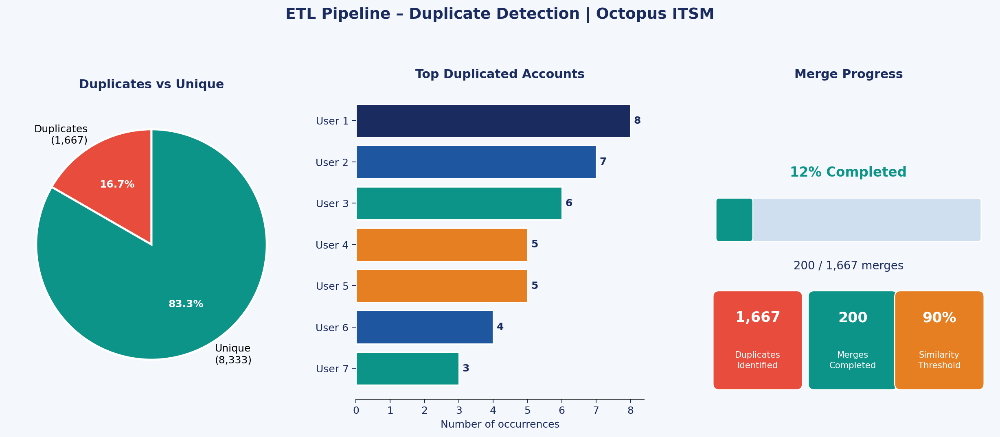

# 🔍 ETL Pipeline – Duplicate Detection | Octopus ITSM

📌 Project Overview
Volunteer Data Analyst project focused on detecting and resolving duplicate user accounts in the Octopus ITSM system as part of a data quality initiative.

🛠️ Tech Stack

Python — pandas, numpy, matplotlib
Excel — Power Query, DAX
Jupyter Notebook

⚙️ Pipeline Steps

Load — Import data from Excel source file
Clean — Normalize names (lowercase, remove accents, trim spaces)
Detect — Exact duplicates via pandas + similar duplicates via rapidfuzz (90%+ threshold)
Export — CSV results (UTF-8 BOM, Excel-ready)
Report — Statistics, visualizations, and presentation

📊 Key Results
MetricValueDuplicates identified1,667Account merges completed200 (12%)Similarity threshold90%

📁 Files
FileDescriptiondetection_doublons_octopus_v2.ipynbMain notebookrapport_detection_doublons_octopus.pptxProject presentation

👩‍💻 Author
Bouchra Belharrane — Data Analyst
LinkedIn : www.linkedin.com/in/bouchrabelharrane

